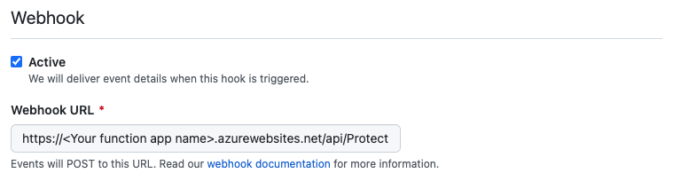

# BranchProtectionBot - GitHub App

[](https://github.com/yuhattor/BranchProtectionBot/actions/workflows/main.yml)


**BranchProtectionBot** is a GitHub App that enables you to protect your default branch.

To prevent commits from being lost due to accidental force pushes, you should protect your branch. However, it's very hard to apply protection rules every single time right after your organization member creates a repository. This bot automates the process to apply the rule and inform you about the protection rules applied to the repository.

BranchProtectionBot is easy to deploy. Please visit **[HERE](https://github.com/apps/BranchProtectionBot)** to install the bot in your organization.

## How to use

There are three steps to protect your branch and manage your protection rules

1. Installing the bot.
2. A new branch created in the organization will be protected.
3. You can edit the default rule settings for branch protection.


## Architecture and process

### Process to protect master/main branch


1. When your organization member creates a new repository in the organization, BranchProtectionBot streams the repository's "created" event.
2. Azure Functions trigger BranchProtectionBot API. (```POST: /api/ProtectMaster```)
3. BranchProtectionBot API initiates the repository with README.md. The default branch is also created at the same time.
4. BranchProtectionBot API protects the default branch. BranchProtectionBot supports both master and main as the default branch.
5. BranchProtectionBot API creates an issue in the repository. It also mentions a specific user.

### Process to register application


1. When the bot is installed, registration callback api on Azure Functions is called. (```GET: /api/ReceiveInstallation```)
2. The api registers organization and installation ID. After registration, the api provide a password to manage the servie setting.
3. User can edit BranchProtectionBot setting by accessing the edit page.(```GET: /api/EditRule```)
4. The API updates the CosmosDB.(```POST: /api/UpdateRule```)

## Bring Your Own App

You can host BranchProtectionBot by yourself. If you want to deploy the app, you will need an Azure environment. The app is hosted on Azure Functions and connect to Azure CosmosDB. Deployment can be easily done by Azure Bicep (Infrastructure as Code) and GitHub Actions.

### Prerequisites

- Your GitHub Apps
- Azure (Azure Functions and Azure CosmosDB)

### Step 1: Provision the infrastructure and Deploy apps on Azure

1. Fork and clone this repository

2. Deploy Azure Resources with Infrastructure as Code templates. Run the script as follow

   ```bash
   # Define your resource group name and the region to deploy
   ResourceGroupName=ProtectionBotRG
   ResourceRegion=japaneast
   
   # Deploy Azure resources with Azure Bicep, IaC service
   az login
   az group create --name $ResourceGroupName --location $ResourceRegion
   az deployment group create --resource-group $ResourceGroupName --template-file main.bicep --parameters appInsightsLocation=$ResourceRegion
   ```

   NOTE: You will get the param, `postInstallationUrl` and `webhookUrl` after the successfull deployment. Please note the params. These params will be used for setting up GitHub App.

3. Setup GitHub Actions for the app deployment
   Get the secrets that you will use for GitHub Actions pipeline beforehand

   ```bash
   # Get the Service Principal Info
   az ad sp create-for-rbac --name "BranchProtectionBot" --role contributor --scopes /subscriptions/<YOUR SUBSCRIPTION ID> --sdk-auth
   ```

   Set the params in the GitHub Actions secrets

   Input |Parameters
   -----|-----
   AZURE_CREDENTIALS | json string you get from running `az ad sp  create-for-rbac` command
   AZURE_FUNCTIONAPP_NAME | What you get from the IaC deployment output (example: botapp-ph7bvwxlx7l3g)

4. Run GitHub Actions

### Step 2: Create and configure GitHub App

After you have done the configuration, next you need to setup the GitHub App

1. On GitHub, go to `Settings` > `Developer settings` > [`GitHub Apps`](https://github.com/settings/apps)

2. Then click `New GitHub App` button

3. Register new GitHub App

   Input|Value
   ---|---
   Post installation | https://\<Your function app name\>.azurewebsites.net/api/ReceiveInstallation 
   Webhook URL| https://\<Your function app name\>.azurewebsites.net/api/ProtectMaster 
   Webhook | active

4. Set the `Repository Permissions`
   Only the important settings are listed here.

   1. General Settings

      Permissions|Value|Detail
      ---|---|---
      Administration | Read & Write | This permission is necessary to apply branch protection rule
      Contents | Read & Write | This permission is necessary to initiate repository with README.md
      Issues | Read & Write | This permission is necessary to create an issue

   2. Events subscription settings
      Subscribe to events|Check
      ---|---
      Repository| true

   3. Confirm Creation

5. After the creation
   Please memo your App ID. This will be used for API's App Configuration.
   

6. Generate and Download GitHub Apps' PEM key
   You will need PEM as well for API's App Configuration.
   

   Please refer to [the documentation](https://developer.github.com/apps/building-github-apps/authenticating-with-github-apps/) to get PEM file and App ID. And to learn more about GitHub Apps, please check [this documentation](https://docs.github.com/ja/github-ae@latest/developers/apps/about-apps)

7. Configure your Azure Function's apps config.
   You are almost there! Finally, you need to run the GitHub App PEM and App ID for function app

   ```

   # Set your GitHub App ID to a variable
   app_id=<YOUR_APP_ID>

   # Set your GitHub App PEM to a variable
   pem_path=<YOUR PATH TO THE>/branchprotectionbot.private-key.pem
   pem_str=$(awk 'NF {sub(/\r/, ""); printf "%s\\n",$0;}' $pem_path)
   echo $pem_str

   # Configure API's setting
   az webapp config appsettings set -g $ResourceGroupName -n <YOUR_APP_NAME> --settings gh_app_pem=$pem_str gh_app_id=$app_id
   ```

   Please refer to [the link](https://docs.microsoft.com/en-us/azure/azure-functions/functions-how-to-use-azure-function-app-settings) for Azure Functions configuration

8. Your branch will be protected!
   

## Licensing

The GitHub App is licensed under a Creative Commons Attribution-ShareAlike 4.0 International License. Please see LICENSE.txt in this repository for the full text of the license.
